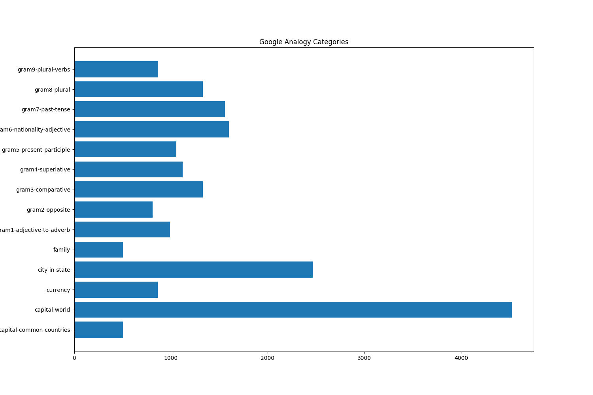
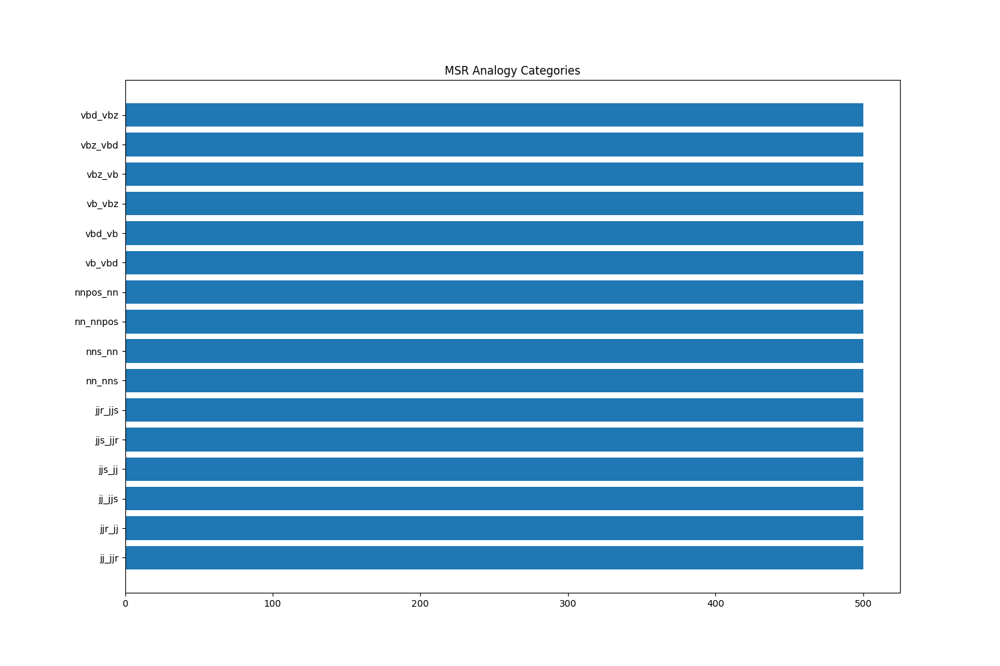

# Word Embedding

t contains helpful sources as well as some evaluations/analyzations/applications of popular pretrained embeddings as well as some scripts to train, visualize, and evaluate, embeddings on your own.

## Background
Goals
1. Use various embedding techniques to embed English words
2. Project the embeddings onto the 2-D space (using tool t-SNE) and discuss observations from the visualizations
3. Applications of word embeddings on Sentiment Analysis

## Environment
Python 3.8.18

## Files
```
data/               # store all the datasets/pretrained embeddings here
out/                # all the trained models will be here
SentimentAnalysis/  # Applications of trained embeddings on sentiment analysis
run.py              # Gives some example how to train your own embeddings
visualize.ipynb     # Gives some examples to visualize word embeddings
```

## Datasets
Here is a list of corpus that can be used for embedding. Note that some datasets are preprocessed while some have not been and require additional preprocessing befor you embed them

- [Daily Dialog](http://yanran.li/dailydialog.html) - A multi-turn open-domain English dialog dataset. It contains 13,118 dialogues.
- Wikipedia Dump
  - [EnWiki8, EnWiki9, Text8](http://mattmahoney.net/dc/textdata.html)
  - [Wiki-dumps-zh](https://github.com/lzhenboy/word2vec-Chinese?tab=readme-ov-file)
  - [Wiki-6B]()
- [Twitter-27B]()
- [Common Crawl](https://commoncrawl.org)
- [Google News Corpus]()
- [Penn Tree Bank](https://catalog.ldc.upenn.edu/LDC99T42)
- [Book Corpus](https://github.com/soskek/bookcorpus?tab=readme-ov-file)
- [中国闲聊数据集](https://github.com/codemayq/chinese-chatbot-corpus)
- [WMT-1翻译数据集(2018)](https://www.statmt.org/wmt18/translation-task.html)
- [中国古诗数据集](https://github.com/congcong0806/Chinese-Poetry-Dataset)
- [二十九-近1GB的三千万聊天语料](https://wohugb.github.io/chatbot/29.corpus-1g/)
- [MNBVC](https://github.com/esbatmop/MNBVC)
- [NewsGroup Dataset](http://qwone.com/~jason/20Newsgroups/) or in [json](https://raw.githubusercontent.com/selva86/datasets/master/newsgroups.json) format.


## Pretrained Embeddings/Vectors
Here is a list of pretrained embeddings and where you can find them. Some of them are pretrained on the datasets listed above.
- [Word2Vec, Google News Embeddings](https://github.com/mmihaltz/word2vec-GoogleNews-vectors) - Word2vec embeddings (3 million 300-dimension english word vectors) trained on Google News corpus (3 billion running words)
- [GloVe Wikipedia 2014 + Gigaword 5](https://nlp.stanford.edu/projects/glove/) - GloVe, 6B tokens, 400K vocab, uncased, 50d, 100d, 200d, & 300d vectors
- [Glove Twitter](https://nlp.stanford.edu/projects/glove/) - GloVe, 2B tweets, 27B tokens, 1.2M vocab, uncased, 25d, 50d, 100d, & 200d vectors
- [NLPL word embeddings repository](http://vectors.nlpl.eu/repository/) - Contains a ton of pretrained word embeddings, what corpus they were trained on, and using what algorithms


A table.

| Name         | Type     | Vector Size       | Vocab size |
| ------------ | -------- | ----------------- | ---------- |
| GoogleNews   | Word2Vec | 300               | 3,000,000  |
| GloveTwitter | Glove    | 50, 100, 200, 300 | 1,200,000  |
| Common Crawl | Glove    | 300               | 1,900,000  |
| Common Crawl | Glove    | 300               | 2,200,000  |

## Visualizaiton Methods
- Scatter Plots with reduction (TSE, PCA)
- Word Clouds

## Embedding Methods
- Word2vec
- GloVE
- HPcA
- morphoRNNLM
- LexVec
- ConceptNet
- HDC/PDC
  

## Embedding evaluations (metrics)
First, let's look at a basic overview.
**Analogy Datasets**
- [WordRep](https://www.dropbox.com/sh/5k78h9gllvc44vt/AAALLQq-Bge605OIMlmGBbNJa?dl=1)
- [Google Analogy](https://www.dropbox.com/s/eujtyfb5zem1mim/EN-GOOGLE.txt?dl=1)
- [MSR Analogy](https://www.dropbox.com/s/ne0fib302jqbatw/EN-MSR.txt?dl=1)
- [SemEval2012](https://www.dropbox.com/sh/aarqsfnumx3d8ds/AAB05Mu2HdypP0pudGrNjooaa?dl=1)

**Similarity Datasets**
- [WS353 or wordsim354]() - WS353 dataset for testing attributional and relatedness similarity
- [SimLex999](https://www.dropbox.com/s/0jpa1x8vpmk3ych/EN-SIM999.txt?dl=1) -  SimLex999 dataset for testing attributional similarity
- [TR9856](https://www.research.ibm.com/haifa/dept/vst/files/IBM_Debater_(R)_TR9856.v2.zip) - TR9856 dataset for testing multi-word term relatedness
- [MTurk](https://www.dropbox.com/s/f1v4ve495mmd9pw/EN-TRUK.txt?dl=1) - MTurk dataset for testing attributional similarity
- [RG65](https://www.dropbox.com/s/chopke5zqly228d/EN-RG-65.txt?dl=1) - Rubenstein and Goodenough dataset for testing attributional and relatedness similarity
- [RW](https://www.dropbox.com/s/xhimnr51kcla62k/EN-RW.txt?dl=1) - Rare Words dataset for testing attributional similarity
- [MEN](https://www.dropbox.com/s/b9rv8s7l32ni274/EN-MEN-LEM.txt?dl=1) - MEN dataset for testing similarity and relatedness

**Categorization Datasets**
- [AP](https://www.dropbox.com/sh/6xu1c1aan8f83p3/AACMyoLwncNhRkUkqvGurYB6a?dl=1) - Almuhareb and Abdulrahman categorization dataset
- [BLESS](https://www.dropbox.com/sh/5qbl5cmh17o3eh0/AACyCEqpMktdMI05zwphJRI7a?dl=1) - Baroni and Marco categorization dataset
- [Battig](https://www.dropbox.com/sh/ckp4yu7k7xl7u2a/AABhmpgU3ake3T9liA9BR8EBa?dl=1) - 1969 Battig dataset
- [ESSLI 2c](https://www.dropbox.com/sh/d3mcyl3b5mawfhm/AAABygW1rguhI4L0XSw_I68ta?dl=1)
- [ESSLI 2b](https://www.dropbox.com/sh/7gdv52gy9vb4mf2/AACExLgHdbvbBrRZBP6CcdDaa?dl=1)
- [ESSLI 1a](https://www.dropbox.com/sh/h362565r1sk5wii/AADjcdYy3nRo-MjuFUSvb-0ya?dl=1)

## Sentiment Analysis
- [Yelp](https://www.yelp.com/dataset) - An all-purpose dataset for learning
- [Twitter US Airline Sentiment](https://www.kaggle.com/datasets/crowdflower/twitter-airline-sentiment) - Analyze how travelers in February 2015 expressed their feelings on Twitter

**Resources**
Here are some good resources for evalating pre-trained/trained embeddings
- https://github.com/kudkudak/word-embeddings-benchmarks
- https://nlp.gluon.ai/examples/word_embedding_evaluation/word_embedding_evaluation.html

## Google Analogy Benchmark
The google analogy benchmark has a total of 19544 questions across 14 different categories.


## MSR Analogy Benchmark
The MSR analogy benchmark has a total of 8000 questions across 16 categoires.


A more detailed description of the benchmark cateogires can be found here.

## Applications
- Sentiment Anaysis

## Others
Feel free to add to this list!


