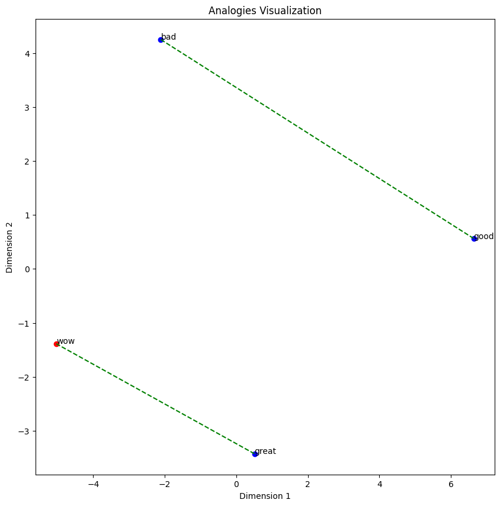

# Report
This report aims to compare different word embeddings created from different corpus and different embedding methods. We also try to visualize these embeddings using techniques such as PCA and TSNE reduction. We also measure their efficiency on downstream tasks like analogies and use popular benchmarks to see how good these embeddings. Then, we also see some use cases of these word embeddings like in Sentiment Analysis

We mainly focus on five embedding corpus. [Daily Dailogue](http://yanran.li/dailydialog.html), [Text8](http://mattmahoney.net/dc/textdata.html), [Google News Vector](), and [GloVe Twitter 27B](). [20 News Group]()

## Environment
This code uses Python 3.8.18. The CPU used the Intel(R) Xeon(R) Platinum 8336C CPU @ 2.30GHz.

## Visualizations
Let's first focus on visualizing our embeddings for different corpus.

### Daily Dialogue
Daily Dialogue, when trained with a `vector_size=100`, `window=5`, `min_count=1` with gensim's `Word2Vec` function, we obtained a vocabulary size of 18683. Here is an overall visualzation of the first `n=1000` words.


We can also visualize a 3D embeddings.


Let's visualize "good" vs "bad" and their most similar words.


Let's try visualizing "airplane" "car", "boat", and "train".


We can also try to visualize some analogies. However Daily Dialogue performs terribly with analogies.

| King - Man + Woman                               | Car - Road + Water                               | Great - Good + Bad                               |
| ------------------------------------------------ | ------------------------------------------------ | ------------------------------------------------ |
|  |  |  |

We see that the most similar vectors to the analogy equation word1 - word2 + word3 does not contain the correct terms.

### GoogleNews
Here, we provide some visualizations on the googlenew pretrained embeddings.

Let's try visualizing "airplane" "car", "boat", and "train" with both PCA and TSNE visualization. It seems that in both cases, there is a pretty clear distinction of the four different groups. This performs much better than the embeddings trained on the Daily Dialogue dataset.


Now let's visualize some analogy vectors.

| King - Man + Woman                               | Car - Road + Water                               | Great - Good + Bad                               |
| ------------------------------------------------ | ------------------------------------------------ | ------------------------------------------------ |
|  |  |  |

Both the first and last one perform better than Daily Dialogue, however still struggles with presenting Boat as the analogy for the middle one.

Let's visualize how perplexity affects tsne.


Perplexity value, which in the context of t-SNE, may be viewed as a smooth measure of the effective number of neighbors. It is related to the number of nearest neighbors that are employed in many other manifold learners (see the picture above). According to [1], it is recommended to select a value between 5 and 50. In this case, an optimal perplexity value seems to be 30.


### 20 News Group
LDA and LSI was performed on this dataset, so the visualizations are a bit different.

> 


## Evaluations
Now let's evaluate our embeddings. But, before we begin, here is some terminology.
```sh
100d = vector size of 100
5w = window size of 5
5k = correct answer of analogy is into top 5 similar vectors of analogy
```

##  Google Analogy Benchmark
Here, we compare embeddings on the google analogy benchmark.
```
dailydialog (word2vec, 100d, 5w, 5k) - 203 total correct
dailydialog (word2vec, 300d, 5w, 5k) - 182 total correct
text8 (word2vec, 100d, 5w, 5k) - 649 total correct
googlenewsvector (word2vec, 300d, 5w, 5k) - 1858 total correct
glovetwitter (glove, 100d) - 
```

### dailydialog (word2vec, 100d, 5w, 5k)
```shell
Total correct: 203
Analogies attempted: 8618
Correct_per_category {
    'capital-common-countries': 6,
    'capital-world': 3, 
    'family': 157, 
    'gram3-comparative': 4, 
    'gram8-plural': 28,
}
```

### text8 (word2vec, 100d, 5w, 5k)
```shell
Total correct: 649
Analogies attempted: 19170
Correct_per_category {
    'capital-world': 8, 
    'family': 206, 
    'gram1-adjective-to-adverb': 28, 
    'gram2-opposite': 89, 
    'gram3-comparative': 9,
    'gram5-present-participle': 77, 
    'gram7-past-tense': 86, 
    'gram8-plural': 111, 
    'gram9-plural-verbs': 26,
}
```

### googlenewsvector (word2vec, 300d, 5w, 5k) 
```shell
100%|██████████| 19544/19544 [1:02:20<00:00,  5.22it/s]
Total correct: 1858
Analogies attempted: 23077
Correct_per_category {
    'capital-common-countries': 8, 
    'capital-world': 7, 
    'family': 180, 
    'gram3-comparative': 10, 
    'gram8-plural': 779, 
    'city-in-state': 2, 
    'gram1-adjective-to-adverb': 13, 
    'gram2-opposite': 23, 
    'gram5-present-participle': 361, 
    'gram6-nationality-adjective': 29, 
    'gram7-past-tense': 302, 
    'gram9-plural-verbs': 132,
}
```

### glovetwitter27B (glove)
```shell
100%|██████████| 19544/19544 [18:27<00:00, 17.64it/s] 
Total correct: 467
Analogies attempted: 18818
Correct_per_category {
    'capital-world': 11, 
    'city-in-state': 2, 
    'family': 89, 
    'gram1-adjective-to-adverb': 1, 
    'gram2-opposite': 11, 
    'gram5-present-participle': 70, 
    'gram7-past-tense': 53, 
    'gram8-plural': 220, 
    'gram9-plural-verbs': 1
}
```
### Summary
dailydialog poor performance across the board except in family category, which kind of makes sense, because the family category could contain terms that are used most in every day conversations. Increasing the embedding dimension from 100 to 300 only decreases the total correct. It is important to note that poor performance is also because many of the analogies could not be made (due to abscence of words in the dictionary.) In fact, out of the 19,544 questions, only 8618 analogies were attempted.

text8 does considerably better than dailydialog, able to handle a lot more grammer related analogies. This is pecause the dataset, pulled from wikipedia, should be more grammar sensitive (has correct grammer).

googlenewsvector does alot better with a much bigger size. dailydialog trained embeddings has a dictionary size of only 18,683 compared to googlenewsvector of 3,000,000.


## MSR Analogy Benchmark
Again, dailydialog performs very poorly on syntatic analogies.

```sh
Total correct: 11
Analogies attempted: 5191
Correct_per_category {
    'jj_jjr': 1, 
    'nn_nns': 1, 
    'vbd_vbz': 3, 
    'vbz_vbd': 2
}
```
I guess that in daily conversations, one deesn't really care about syntax as much.

### googlenewsvector (word2vec, 300d, 5w, 5k)
```sh
100%|██████████| 8000/8000 [29:19<00:00,  4.55it/s]
Total correct: 1037
Analogies attempted: 8000
Correct_per_category {
    'jjs_jj': 16, 
    'jjr_jj': 8, 
    'jj_jjr': 2, 
    'jj_jjs': 10, 
    'nn_nns': 263, 
    'nns_nn': 228, 
    'nn_nnpos': 132, 
    'nnpos_nn': 179, 
    'vbz_vb': 34,
    'vb_vbz': 31, 
    'vbd_vb': 56, 
    'vbd_vbz': 8, 
    'vb_vbd': 50,
    'vbz_vbd': 6,
}
```

Here, google news is fairly good.

### glovetwitter (glove, 100d)
```sh
100%|██████████| 8000/8000 [07:33<00:00, 17.64it/s] 
Total correct: 326
Analogies attempted: 7682
Correct_per_category {
    'jjr_jj': 0, 
    'jj_jjs': 10, 
    'jjs_jj': 7, 
    'nn_nns': 121,
    'nns_nn': 108, 
    'nn_nnpos': 24, 
    'nnpos_nn': 19, 
    'vbz_vb': 16, 
    'vb_vbd': 3, 
    'vbd_vb': 2, 
    'vb_vbz': 4, 
    'vbd_vbz': 0
}
```

Worse than google news.


## Similarity
Let's look at similarity across the board

Corr
| Embedding       | WS353    | SimLex999 | RG65     | RW       | MTurk    |
| --------------- | -------- | --------- | -------- | -------- | -------- |
| dialydialog     | 0.187423 | 0.048257  | 0.040202 | 0.037973 | 0.05752  |
| glovetwitter27b | 0.521232 | 0.12031   | 0.677449 | 0.326495 | 0.565017 |
| text8           | 0.606827 | 0.250728  | 0.498213 | 0.282036 | 0.601542 |
| googlenews      | 0.700017 | 0.441966  | 0.760783 | 0.53421  | 0.683969 |


Checked
| Embedding       | WS353   | SimLex999 | RG65  | RW        | MTurk   |
| --------------- | ------- | --------- | ----- | --------- | ------- |
| dialydialog     | 280/353 | 899/999   | 35/65 | 279/2034  | 186/287 |
| glovetwitter27b | 334/353 | 998/999   | 65/65 | 1063/2034 | 286/287 |
| text8           | 335/335 | 999/999   | 65/65 | 1530/2034 | 286/287 |
| googlenews      | 353/353 | 999/999   | 65/65 | 1825/2034 | 275/287 |

**Summary**: 

## Categorization
Let's look at categorization across the board.

Categoriation
| Embedding       | AP       | BLESS | BATTIG   | ESSLI_2c | ESSLI_2b | ESSLI_1a |
| --------------- | -------- | ----- | -------- | -------- | -------- | -------- |
| dailydialog     | 0.149254 | 0.22  | 0.095775 | 0.511111 | 0.45     | 0.431818 |
| glovetwitter27b | 0.462687 | 0.695 | 0.318868 | 0.511111 | 0.65     | 0.795455 |
| text8           | 0.460199 | 0.435 | 0.226152 | 0.488889 | 0.8      | 0.613636 |
| googlenews      | 0.639303 | 0.79  | 0.382527 | 0.644444 | 0.8      | 0.75     |

## Applications

### Sentiment Analysis on Twitter Airline Tweets
More details can be found in `./Downstream/SA_TwitterUSAirlineTweets.ipynb`. In this example case, whether or not different embeddings can aid in the training of a sentiment analysis.

| Accuracy                               | Loss                                   |
| -------------------------------------- | -------------------------------------- |
|  |  |


## Summary


## Citations
[1]: L. Maate and G. Hinton, “Visualizing data using t-SNE”, Journal of Machine Learning Research, vol. 9, pp. 2579–2605, 2008.